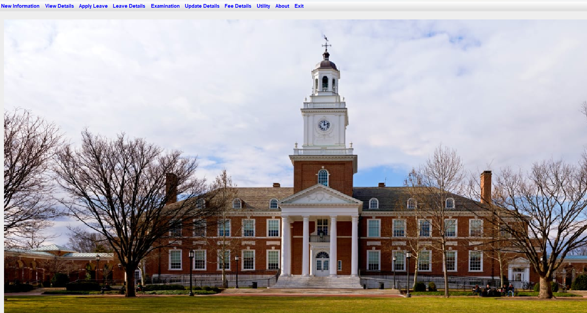

# University Management System

## Table of Contents
- [Introduction](#introduction)
- [Features](#features)
- [Installation](#installation)
- [Usage](#usage)
- [Project Structure](#project-structure)
- [Database Setup](#database-setup)
- [Screenshots](#screenshots)
- [Contact](#contact)

---

## Introduction

This **University Management System** is a Java Swing desktop application designed to manage student records efficiently. The system allows administrators to add new students, update student details, manage student leave applications, and view leave details. It interacts with a backend database to store and retrieve student information.

---

## Features

- Add new student records with personal and academic details.
- Update existing student information.
- Apply for student leave with date and duration.
- View detailed student leave records.
- Search leave records by student roll number.
- Print leave details.
- Intuitive and user-friendly GUI built using Java Swing.
- Uses JDBC for database connectivity.

---

## Installation

### Prerequisites:
- JDK 8 or above installed.
- An IDE like Eclipse, IntelliJ IDEA, or NetBeans (optional but recommended).
- MySQL database server installed and running.
- **MySQL JDBC Driver** added to your project’s build path.
- `toedter` library for JDateChooser component.
- `rs2xml.jar` (from `net.proteanit.sql.DbUtils`) for displaying result sets in JTable.

### Steps:
1. Clone or download the project source code.
2. Set up the MySQL database using the provided SQL script or manually create the required tables (`student`, `studentleave`).
3. Add MySQL JDBC driver, toedter-calendar, and rs2xml.jar libraries to your project classpath.
4. Configure your database credentials inside the `Conn` class (database connection class).
5. Compile and run the Java application via your IDE or command line.

---

## Usage

### Application Modules:

#### 1. Add Student
- Input student details like name, father’s name, DOB, address, phone, email, academic scores, Aadhar, course, and branch.
- Click "Submit" to save the record to the database.

#### 2. Update Student
- Select a student by roll number.
- Modify address, phone, email, course, or branch.
- Click "Update" to save changes.

#### 3. Student Leave
- Select roll number.
- Pick leave date using the calendar.
- Choose leave duration (Full day/Half day).
- Click "Submit" to apply leave.

#### 4. Student Leave Details
- Search leave records by roll number.
- View all leave records in a table.
- Print leave details.
- Cancel to exit the window.
#### 5. Add Teacher
- Input teacher details including name, father's name, date of birth, address, phone, email, education, department, employee ID, and designation.
- Click "Submit" to save the teacher record to the database.

#### 6. Update Teacher
- Select a teacher by employee ID.
- Modify address, phone, email, education, department, or designation.
- Click "Update" to save the updated information.

#### 7. Teacher Leave
- Select employee ID.
- Pick leave date using the calendar.
- Choose leave duration (Full day/Half day).
- Click "Submit" to apply for leave.

#### 8. Teacher Leave Details
- Search leave records by employee ID.
- View all leave records in a table format.
- Print leave details.
- Cancel to exit the window.

---

## Project Structure

```university.management.system
│
├── AddStudent.java            # GUI & logic to add student
├── UpdateStudent.java         # GUI & logic to update student info
├── StudentLeave.java          # GUI & logic for student leave application
├── StudentLeaveDetails.java   # Display & search student leave details
├── AddTeacher.java            # GUI & logic to add teacher
├── UpdateTeacher.java         # GUI & logic to update teacher info
├── TeacherLeave.java          # GUI & logic for teacher leave application
├── TeacherLeaveDetails.java   # Display & search teacher leave details
├── Conn.java                  # Database connection handler
└── (other utility classes)```


---

## Database Setup

Create the necessary tables in your MySQL database.

```sql
CREATE TABLE student (
    rollno VARCHAR(20) PRIMARY KEY,
    name VARCHAR(100),
    fname VARCHAR(100),
    dob DATE,
    address VARCHAR(255),
    phone VARCHAR(15),
    email VARCHAR(100),
    class_x FLOAT,
    class_xii FLOAT,
    aadhar VARCHAR(20),
    course VARCHAR(100),
    branch VARCHAR(100)
);

CREATE TABLE studentleave (
    rollno VARCHAR(20),
    date DATE,
    duration VARCHAR(20),
    FOREIGN KEY (rollno) REFERENCES student(rollno)
);

### Screenshots

  
*Main navigation screen with module options.*

  
*Form to input new student details.*

  
*Update student information by selecting roll number.*

  
*Apply leave for a student with date and duration.*

  
*View and search student leave records.*

  
*Manage student fee payments.*

  
*Input marks for students in various subjects.*

  
*View detailed academic results for students.*

  
*Form to input new teacher details.*

  
*Update teacher information by selecting employee ID.*

  
*Apply leave for a teacher with date and duration.*

  
*View and search teacher leave records.*


### Contact

For any queries or issues, feel free to contact:

Aparna B B

Email: aparnabhaskarbelur@gmail.com 
GitHub: https://github.com/Aparna-b-b

Thank you for using the University Management System!  
Feel free to contribute or suggest improvements.


